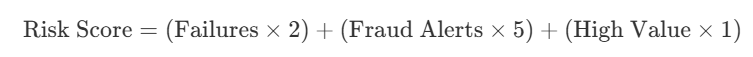

# Melio — SMB Vendor Payments Platform

A modern fintech web application built with **React / Next.js 14**, **TypeScript**, **Tailwind CSS**, and **SQLite** that simulates a vendor payments platform similar to Melio or Bill.com.  It simulates these Accounts Payable/Receivable software for SMBs and Accountants

---

## Overview

The application simulates a vendor payments platform using mock data and local API routes, demonstrating a realistic payments workflow and financial dashboard, as though they were running in a real production environment on AWS.

### Core Features

1. **Dashboard** — summary cards for total payments, pending payments, completed payments, and failed payments; recent activity feed showing payment events; charts for payment volume and status distribution
2. **Vendors** — vendor list table, vendor details page, payment method info (ACH or card), mock bank verification status
3. **Invoices** — invoice list, mock invoice upload, invoice approval workflow, attach invoice to vendor
1.  **Dashboard** — summary cards for total payments, pending payments, completed payments, and failed payments; recent activity feed showing payment events; charts for payment volume and status distribution
2.  **Vendors** — vendor list table, vendor details page, payment method info (ACH or card), mock bank verification status
3.  **Invoices** — invoice list, mock invoice upload, invoice approval workflow, attach invoice to vendor
4.  **Payments** — create payment, select vendor and invoice, choose payment method, schedule payment, payment status lifecycle: draft → scheduled → processing → settled → failed
5.  **Transactions Feed** — event-style log similar to Stripe webhooks tracking payment lifecycle events
6.  **Reconciliation Page** — table showing invoice amount vs payment amount, settlement batch grouping, highlight mismatches
7. **Real-time Fraud & Risk Monitoring**: Flag suspicious payments dynamically.
- **Rule-based Engine**: Evaluates volume spikes, high-risk countries, and frequent failures.
- **Anomaly Detection**: Flags behavioral patterns like payment frequency vs. volume anomalies.
- **Risk Dashboards**: Global and vendor-level visualizations (trends & velocity).
- **Vendor-Level Risk Model**: Scores vendors dynamically using the formula:
  
  
  
  $$ \text{Risk Score} = (\text{Failures} \times 2) + (\text{Fraud Alerts} \times 5) + (\text{High Value} \times 1) $$
8.  **Dev Console** — mock developer API console for generating API keys, simulating payments, viewing request logs, and triggering mock webhooks
9.  **Partner Portal** — simulator for onboarding external partners, monitoring their API usage, managing webhook connections, and rotating partner API keys
10.  **System Events** — real-time event log and service telemetry dashboard with timeline and architecture visualizations
11.  **Double-Entry Ledger** — core accounting system with strict double-entry invariants, transaction journal, and immutable audit trail
12.  **Retry Queue** — automated backoff simulation tracking failed payments with customizable exponential retry intervals

### Design & Architecture

The application features a clean, professional fintech UI with sidebar navigation and responsive layouts. It utilizes component-based architecture with reusable tables and charts, and is powered by realistic seeded SQLite database records fetched via local Next.js API Routes.

---

## Getting Started

```bash
npm install
npx tsx scripts/seed.ts   # seed the SQLite database
npm run dev               # → http://localhost:3000
```

To re-seed the database with fresh randomized data at any time:

```bash
npx tsx scripts/seed.ts
```

---

## Architecture

| Layer | Files | Description |
| ----- | ----- | ----------- |
| **Database** | `src/lib/db.ts` | SQLite connection, schema init, row-to-camelCase mappers |
| **Seed Script** | `scripts/seed.ts` | Generates ~30 vendors, ~100 invoices, ~65 payments, ~150 events, ~40 fraud alerts |
| **Types** | `src/lib/types.ts` | All domain entities (Vendor, Invoice, Payment, TransactionEvent, etc.) |
| **Utilities** | `src/lib/utils.ts` | Currency formatting, date formatting, `cn()`, status colors |
| **API Routes** | `src/app/api/` | REST endpoints querying SQLite (including fraud-monitor, dev-console) |
| **Components** | `src/components/` | Sidebar, DataTable, SummaryCard, StatusBadge, PageHeader, ThemeProvider, RiskScoreBar |
| **Pages** | `src/app/` | 9 feature pages + vendor & partner detail pages |

---

## Feature Pages

### 1. Dashboard (`/`)

-   4 gradient summary cards (Total, Pending, Completed, Failed)
-   Area chart showing 7-month payment volume trend
-   Donut pie chart for status distribution
-   Recent activity feed with event type icons

### 2. Vendors (`/vendors` + `/vendors/[id]`)

-   Searchable vendor table with bank verification status badges
-   Detail page with contact info, payment method, bank info, verification status
-   Related invoices and payments tables per vendor

### 3. Invoices (`/invoices`)

-   Filterable by status (all, pending, approved, rejected, paid)
-   **Upload Invoice** modal with drag-and-drop area
-   **Approval workflow** modal showing invoice details with Approve/Reject actions

### 4. Payments (`/payments`)

-   **Create Payment** modal: select vendor, invoice, payment method (ACH/Card), schedule date
-   **Payment detail** modal with advanced **Payment Lifecycle Timeline** component:
    -   Vertical layout with status icons, timestamps, and active states (Draft → Scheduled → Processing → Settled)
    -   Expandable event details revealing simulated JSON API payloads for each step
-   Failed payments show error reason with red highlight

### 5. Transactions (`/transactions`)

-   Stripe-style webhook event log with event type badges
-   Filterable: `payment.created`, `payment.processing`, `payment.settled`, `payment.failed`
-   Shows timestamp, payment ID, vendor, amount, and failure reasons

### 6. Reconciliation (`/reconciliation`)

-   Summary cards: Total Records, Matched, Mismatches, Net Difference
-   Settlement **batch grouping** (e.g., `BATCH-2026-0308-A`)
-   Invoice amount vs payment amount comparison with **mismatch highlighting**

### 7. Fraud Monitor (`/fraud-monitor`)

-   4 summary cards: Total Flagged, High Risk, Pending Review, Cleared Today
-   Area chart for 30-day risk trend and Bar chart for rule trigger statistics
-   Suspicious payments table with search, risk filters, and color-coded risk score bars
-   Detail modal showing risk assessment gauge, payment info, triggered rules, vendor risk profile, and transaction history
-   Modular rules engine evaluating payments against customizable fraud patterns (e.g. High Amount, Rapid Payments)

### 8. Dev Console (`/dev-console`)

-   **API Keys**: mock key generation UI, publishable/secret key display, and rotation
-   **Payment API Simulator**: request building form for `/api/dev/payments` auto-filling the active secret key, with dark-themed JSON request and response viewers
-   **Idempotency-Key Support**: `/api/dev/payments` supports the `Idempotency-Key` header. Identical requests with a reused key skip processing and return the originally stored payload, ensuring idempotent retries for robust integrations.
-   **API Logs**: table of developer API requests with latency and status, featuring expandable rows revealing the exact request/response JSON payloads
-   **Webhook Simulator**: dispatch mock Stripe-style lifecycle events (e.g., `payment.succeeded`) and view simulated delivery logs with a retry mechanism

### 9. Partner Portal (`/partner-portal`)

-   **Partner Directory**: table of integrated partners (e.g., Capital One, Stripe) displaying integration health and API usage stats
-   **Partner Dashboard (`/[id]`)**: detailed view featuring Recharts-powered graphs for 30-day API Requests (`requests`) and Latency (`latency_ms`) vs Errors
-   **API Keys & Webhooks**: interactive Client Components with Server Actions for securely rotating keys and registering webhook endpoint subscriptions

### 10. System Events (`/system-events`)

-   **Live Event Stream**: real-time feed of system events (e.g. `payment.created`, `fraud.check.started`) with expandable JSON payloads
-   **Service Architecture Diagram**: visual representation of system microservices with real-time highlighting
-   **Payment Lifecycle Timeline**: temporal visualization of a payment's journey through various services
-   **Filtering**: filter events by service, status, or search by correlation ID

### 11. Double-Entry Ledger (`/ledger`)

The Double-Entry Ledger System provides the core accounting backbone needed for a serious fintech product. Built with robust double-entry invariants (sum of debits matches sum of credits), it guarantees that total assets always equal total liabilities plus equity.

-   **Chart of Accounts**: Real-time view of balances across asset, liability, and equity accounts (e.g., `buyer_wallet`, `vendor_wallet`, `external_capital`).
-   **Transaction Journal**: Immutable audit trail of every financial movement in the system, displaying the transaction ID, account, description, and the strict debit/credit balance.
-   **Business Rationale**: Every serious payment platform must have an internal source of truth that is mathematically proven to be balanced. This prevents "money out of thin air" bugs, ensures compliance readiness, simplifies reconciliation with banking partners, and allows the business to safely scale its payment volume while maintaining full financial integrity.

### 12. Retry Queue (`/retry-queue`)

The Retry Queue dashboard visualizes reliability engineering patterns, specifically exponential backoff for handling failed transactions or network timeouts.

-   **Queue Management**: Displays active, pending, resolved, and failed (dead letter) transaction recovery attempts.
-   **Simulation Controls**: Interactive tools to **Inject Failure** and **Simulate Tick** temporal events, watching the queue scale its retry interval automatically (e.g. 1 min → 2 min → 4 min).
-   **Business Rationale**: Building a robust payments system requires graceful failure recovery. Transient network errors, API rate limits, or insufficient fund checks shouldn't permanently fail a payment instantly. An exponential backoff queue ensures that integrations to banking partners or external APIs are resilient, maximizing payment success rates without aggressively overwhelming downstream services.

---

## Database

All data is stored in a local **SQLite** database (`melio.db`) via `better-sqlite3`. The API routes run SQL queries directly — no ORM overhead.

The seed script (`scripts/seed.ts`) programmatically generates randomized but realistic data including:

- ~100+ invoices across all vendors with varying statuses
- ~65 payments spanning the full lifecycle (draft → settled / failed)
- ~150+ transaction events (webhook-style lifecycle logs)
- ~40 reconciliation records grouped into settlement batches
- ~40+ fraud alerts generated by evaluated seeded payments against a simulated rules engine

---

## Theme Toggle

The app ships with a **dark/light theme toggle** in the sidebar. The theme preference is persisted in `localStorage` and applied via CSS custom properties with a `data-theme` attribute on the root element.

---

## Tech Stack

- **Framework:** Next.js 14 (App Router)
- **Language:** TypeScript
- **Styling:** Tailwind CSS
- **Database:** SQLite via better-sqlite3
- **Charts:** Recharts
- **Data Fetching:** TanStack React Query
- **Icons:** Lucide React
- **Date Utilities:** date-fns
